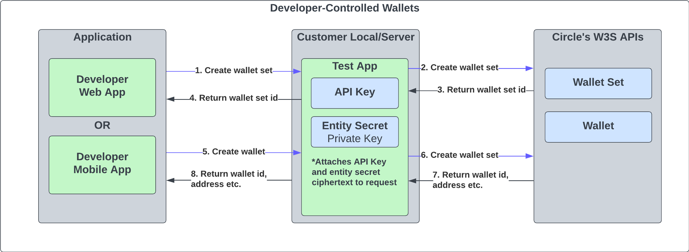

# Web3 Services Test Server

<h4 align="center">Accelerate Integration to Circle's Web3 Services (W3S) APIs</h4>

Our Test Server, built with Node.js and Typescript using the Express.js framework, offers routing for developers looking to seamlessly connect their client app with Circle's W3S APIs.

> <font size=3>⚠️ **Caution: Not intended for Mainnet integration**</font> 
> 
> Please note that the W3S test server is specifically designed for testing purposes only. It should not be used for integrating your application with the Mainnet.

### Setup Steps
1. Install package dependencies
```
npm install
```
2. Create a `.env` file and add your API key.  
   * _NOTE: You can go to [Circle's Developer Console](https://developers.circle.com/) to acquire an API key if you do not already have one._
```
API_KEY="<API_KEY>"
```
3. Start the test server
```
npm run start
```
4. Send your first API request!
```
curl --location 'http://localhost:3000/v1/w3s/wallets'
```

## Why a Test Server?
The test server was created to get developers up and running with Circle's W3S Programmable Wallets and Smart Contract Platform products as quick as possible. It accomplishes this by reducing the time spent on setting up a server app allowing you to focuse on learning our products provide and what you can build with them. 

The test server acts like a proxy, serving as an intermediary between the client application and our APIs. By using the test server, developers can ensure the necessary security measures are in place, including attaching the API key and signing API requests where required.

The benefits of utilizing the test server are:

1. **Quicker API Exploration:** The test server allows you to quickly start trying out our APIs. You aren't required to spend time setting up a authentication and building a boilerplate signing flow. Instead, you can leverage the pre-implemented logic of the test server, reducing the time it takes to begin experimenting with API calls.

2. **Reference Code for Implementation:** The code implemented within the test server can serve as a valuable reference for your own implementation. This code serves as a starting point that can be adapted and extended to suit your specific needs, saving you time and effort during development.

3. **Simplified Entity Secret Management:** Creating and managing an entity secret typically involves additional steps and complexities, as described in our documentation [here](https://developers.circle.com/w3s/docs/entity-secret-management). However, the test server streamlines this process by automating the creation of the entity secret on start-up. It securely stores the entity secret in the `.env` file and generates the entity secret ciphertext on a per-request basis. This means you can skip the upfront steps of manually handling entity secret management. 

   Additionally, the test server seamlessly handles the attachment of the `entitySecretCiphertext` to each API request where required. This eliminates the need for developers to manually manage and include the entity secret ciphertext in their code, saving time and effort during implementation.

The two diagrams below depict the role of the test server when creating a user-controlled or developer-controlled wallet. This visual representation further clarifies how the test server fits into the overall architecture and demonstrates its significance in wallet creation.

### User-Controlled Wallet Example


### Developer-Controlled Wallet Example


## Additional Helper APIs
| API | Description |
| --- | --- |
| `POST /v1/w3s/createUserTokenChallengeId` | Makes a sequence of API request to return the `appId`, `userToken`, `encryptionKey`, and `challengeId` needed to [create your first user-controlled wallet](https://developers.circle.com/w3s/docs/user-controlled-create-your-first-wallet).
| `POST /v1/w3s/createEntitySecretCiphertext` | Creates and returns the entity secret ciphertext to register on [Circle's Developer Console](https://console.circle.com/wallets/dev/configurator).


## FAQs

### What APIs does the test server support?

The Test Server supports all Web3 Service APIs that can be found [here](https://developers.circle.com/w3s/reference). All the test server's APIs mimic the URL and HTTP method used in Circle's APIs. For example, when running the test server locally you would swap out the base URL `https://api.circle.com` ➡ `http://localhost:3000` so a request to list wallets would be GET `http://localhost:3000/v1/w3s/wallets`

### How are Circle's API request API errors returned?

Circle's API errors are passed through the test server back to the client app. It will contain the same HTTP Response Status Code, Headers, and response body.

## Additional Notes

### Generated Code
The code found in `src/client/generated` is generated from Circle's OpenAPI Specification (OAS) using the `src/client/generated/w3s-openapi.yaml` file. This was done using the [openapi-generator-cli](https://openapi-generator.tech) and the [typescript-axios generator](https://openapi-generator.tech/docs/generators/typescript-axios/).

To reproduce the generated code you can run the following command:
```
npx @openapitools/openapi-generator-cli generate -g typescript-axios  \
-i src/client/generated/w3s-openapi.yaml \
-o src/client/generated/ \
-p npmName=circle,supportsES6=true,modelPropertyNaming=original,apiPackage=apis,modelPackage=models --additional-properties=withSeparateModelsAndApi=true
```
